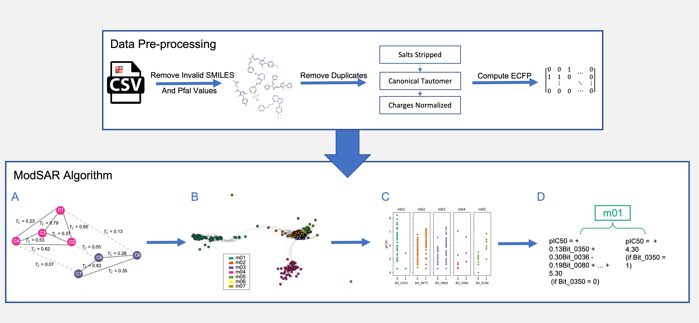

# Optimisation-based Modelling for Explainable Lead Discovery in Malaria

This repository contains the code of data preprocessing, model building, model evaluation and feature importance analysis for [Optimisation-based Modelling for Explainable Lead Discovery in Malaria](). 
## Abstract
**Background:** The search for new antimalarial treatments is urgent due to growing resistance to existing therapies. The Open Source Malaria (OSM) project offers a promising starting point, having extensively screened various compounds for their effectiveness. Further analysis of the chemical space surrounding these compounds could provide the means for innovative drugs.

**Methods:**  We report an optimisation-based method for quantitative structure-activity relationship (QSAR) modelling that provides explainable modelling of ligand activity through a mathematical programming formulation. The methodology is based on piecewise regression principles and offers optimal detection of breakpoint features, efficient allocation of samples into distinct sub-groups based on breakpoint feature values, and insightful regression coefficients. Analysis of OSM antimalarial compounds yields interpretable results through rules generated by the model that reflect the contribution of individual fingerprint fragments in ligand activity prediction. Using knowledge of fragment prioritisation and screening of commercially available compound libraries, potential lead compounds for antimalarials are identified and evaluated experimentally via a *Plasmodium falciparum* asexual growth inhibition assay (PfGIA) and a human cell cytotoxicity assay.

**Conclusions:** Three compounds are identified as potential leads for antimalarials using the methodology described above. This work illustrates how explainable predictive models based on mathematical optimisation can pave the way towards more efficient fragment-based lead discovery as applied in malaria.
## Requirements
The OSM dataset can be downloaded at [the Google sheet of all OSM chemicals](https://docs.google.com/spreadsheets/d/1Rvy6OiM291d1GN_cyT6eSw_C3lSuJ1jaR7AJa8hgGsc/edit#gid=510297618).

This code was tested in Python 3.8. All requirements are provided and can be set up using conda.
```
conda env create -f environment.yml
conda activate modsar
```
## Cite us
Li, Yutong, et al. "Optimisation-based modelling for explainable lead discovery in malaria." Artificial intelligence in medicine 147 (2024): 102700.

```
@article{li2024optimisation,
  title={Optimisation-based modelling for explainable lead discovery in malaria},
  author={Li, Yutong and Cardoso-Silva, Jonathan and Kelly, John M and Delves, Michael J and Furnham, Nicholas and Papageorgiou, Lazaros G and Tsoka, Sophia},
  journal={Artificial intelligence in medicine},
  volume={147},
  pages={102700},
  year={2024},
  publisher={Elsevier}
}
```
